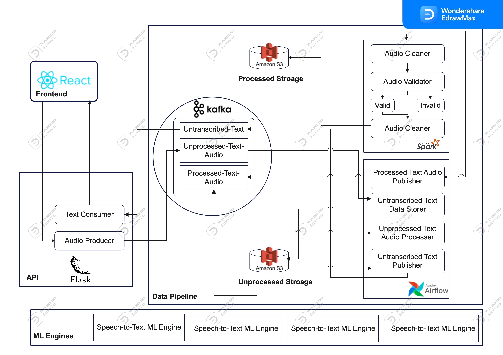

# Speech-to-Text Data Collection
<h1 align="center">African language Speech Recognition - Speech-to-Text </h1>
<div>
<a href="https://github.com/STT-Data-Engineering/Speech_to_text"></a>
<a "https://github.com/STT-Data-Engineering/Speech_to_text/pulls"></a>
<a href="https://github.com/STT-Data-Engineering/Speech_to_text/issues"></a>
<a href="https://github.com/STT-Data-Engineering/Speech_to_text/graphs/contributors"></a>
<a href="https://github.com/STT-Data-Engineering/Speech_to_text/blob/main/LICENSE"></a>
</div>
</br>

**Table of content**

- [Introduction](#Introduction)
- [Pipeline](#Pipeline)
- [Architecture](#Architecture)
- [Project  Structure](#ProjectStructure)
- [Installation](#Installation)


## Introduction
The purpose of this project is to build a data engineering pipeline that allows recording millions of Amharic and Swahili speakers reading digital texts in-app and web platforms. For this project, the Amharic news text classification dataset with baseline performance dataset is used. 
The aim of this project is to produce a tool that can be deployed to process posting and receiving text and audio files from and into a data lake, apply transformation in a distributed manner, and load it into a warehouse in a suitable format to train a speech-to-text model. 

## Pipeline
This is our pipeline of this project that will be used to record millions of Amharic and Swahili speakers reading digital texts in-app and web platforms.  


## Project Structure
There are several files in the repository, including Python scripts, Jupyter notebooks,  and text files. 

## Installation
```
git clone https://github.com/STT-Data-Engineering/Speech_to_text
```

## Contributors
* [Selam Ayehubirhan](https://github.com/sel6) 
* [Henok Tilaye](https://github.com/Hen0k)
* [Biruk Getaneh](https://github.com/bkget)
* [Kevin Shyaka](https://github.com/skevin-dev)
* [Tadesse Kabede](https://github.com/tadesse381)
* [Diye Mark](https://github.com/Danu-B)
* [Danayt Bulom](https://github.com/DiyeMark)
<!-- Copy-paste in your Readme.md file -->


Made with [contrib.rocks](https://contrib.rocks)
 
